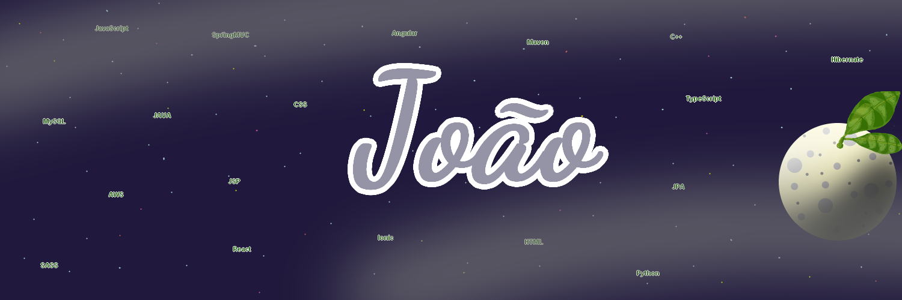

  

<h3 align="center">Software Engineer @ Accenture</h3>

  Full stack · Angular · Java Spring Boot · Ionic

---

## About

Software Engineer at Accenture. I work full stack with Angular and Java Spring Boot, and build mobile experiences with Ionic. Outside work, I explore tools that make development and knowledge work more reliable — from craft projects to data converters and local AI systems.

## Currently learning

Deepening local Gen AI: running open models with Ollama and LM Studio, building RAG pipelines, and designing self-hosted agent workflows that stay stable and productive — for day-to-day work, company use cases, and personal projects.

  
  
  
  

## Skills

  
  
  
  
  
  
  
  
  
  

## Featured work

- **[LockKey](https://github.com/bonbj/PasswordGenerator)** — Password generator for web and mobile, built with Ionic, Angular, and TypeScript
- **[converters](https://github.com/bonbj/converters)** — Modular data conversion tools with a focus on PostgreSQL-oriented workflows
- **[100 Days CSS Challenge](https://github.com/bonbj/100DaysCSSChallenge)** — Daily CSS craft practice inspired by 100dayscss.com

## Connect

  
  

## GitHub

  

