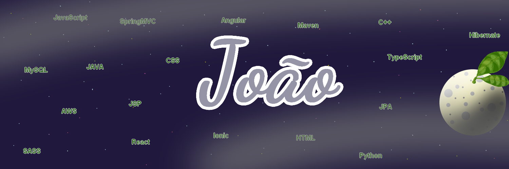

## - 🙋‍♂️ Who am I

>I'm full stack development java and JavaScript, currently I work with mobile development in ionic framework, My job is are on Accenture, In my free time I make code challenges.

 

## - 📚 I’m currently learning

>I'm learning native mobile development, because I know Ionic then use front-end for make one app, so why no learning native development with android and IOS?

 

## - 📱 Social

  

## - 🏆 My achievements on github

  <a href="https://github.com/bonbj">
  
  

